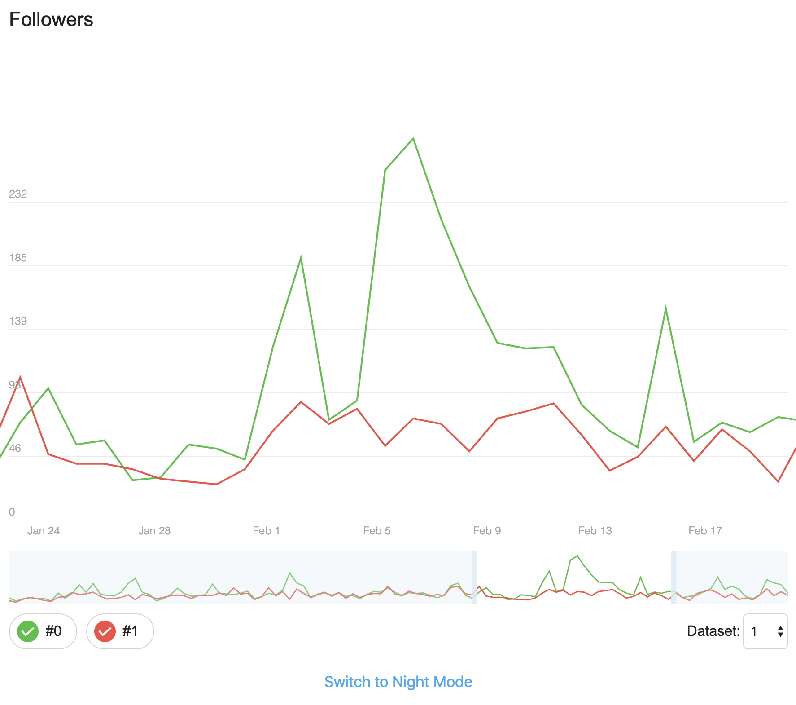

# Chart-my-followers mini app

A mini chart app, developed to participate in [Telegram official coding competition](https://t.me/contest) for developers in March 2019. Visit [chart-my-followers.now.sh](https://chart-my-followers.now.sh) to preview.

- Written in pure JS using observable pattern
- Zero dependencies
- The bundle has 22kb size minified
- Extremely fast & smooth

To run app locally:

- run `yarn` to install dev dependencies
- run `yarn start` for dev version, open localhost:3000
- run `yarn build` and `yarn serve` for prod version, open localhost:3000

